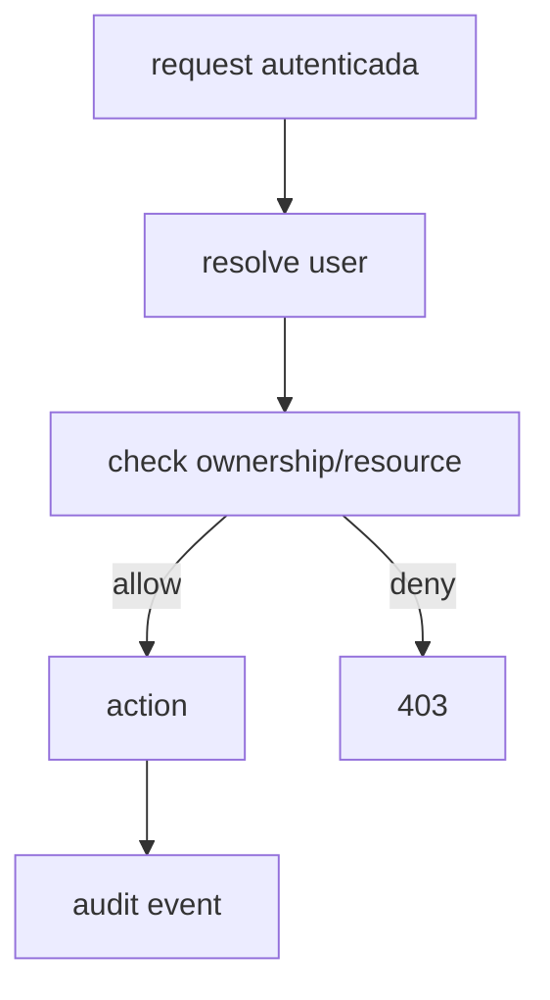

# 1. Título da Feature (Français)

🌐 **Languages:** 🇺🇸 [English](../../../../../_ideia/notfit/feature-43-governanca-de-ownership-por-credencial.md) · 🇪🇸 [es](../../../es/_ideia/notfit/feature-43-governanca-de-ownership-por-credencial.md) · 🇫🇷 [fr](../../../fr/_ideia/notfit/feature-43-governanca-de-ownership-por-credencial.md) · 🇩🇪 [de](../../../de/_ideia/notfit/feature-43-governanca-de-ownership-por-credencial.md) · 🇮🇹 [it](../../../it/_ideia/notfit/feature-43-governanca-de-ownership-por-credencial.md) · 🇷🇺 [ru](../../../ru/_ideia/notfit/feature-43-governanca-de-ownership-por-credencial.md) · 🇨🇳 [zh-CN](../../../zh-CN/_ideia/notfit/feature-43-governanca-de-ownership-por-credencial.md) · 🇯🇵 [ja](../../../ja/_ideia/notfit/feature-43-governanca-de-ownership-por-credencial.md) · 🇰🇷 [ko](../../../ko/_ideia/notfit/feature-43-governanca-de-ownership-por-credencial.md) · 🇸🇦 [ar](../../../ar/_ideia/notfit/feature-43-governanca-de-ownership-por-credencial.md) · 🇮🇳 [hi](../../../hi/_ideia/notfit/feature-43-governanca-de-ownership-por-credencial.md) · 🇮🇳 [in](../../../in/_ideia/notfit/feature-43-governanca-de-ownership-por-credencial.md) · 🇹🇭 [th](../../../th/_ideia/notfit/feature-43-governanca-de-ownership-por-credencial.md) · 🇻🇳 [vi](../../../vi/_ideia/notfit/feature-43-governanca-de-ownership-por-credencial.md) · 🇮🇩 [id](../../../id/_ideia/notfit/feature-43-governanca-de-ownership-por-credencial.md) · 🇲🇾 [ms](../../../ms/_ideia/notfit/feature-43-governanca-de-ownership-por-credencial.md) · 🇳🇱 [nl](../../../nl/_ideia/notfit/feature-43-governanca-de-ownership-por-credencial.md) · 🇵🇱 [pl](../../../pl/_ideia/notfit/feature-43-governanca-de-ownership-por-credencial.md) · 🇸🇪 [sv](../../../sv/_ideia/notfit/feature-43-governanca-de-ownership-por-credencial.md) · 🇳🇴 [no](../../../no/_ideia/notfit/feature-43-governanca-de-ownership-por-credencial.md) · 🇩🇰 [da](../../../da/_ideia/notfit/feature-43-governanca-de-ownership-por-credencial.md) · 🇫🇮 [fi](../../../fi/_ideia/notfit/feature-43-governanca-de-ownership-por-credencial.md) · 🇵🇹 [pt](../../../pt/_ideia/notfit/feature-43-governanca-de-ownership-por-credencial.md) · 🇷🇴 [ro](../../../ro/_ideia/notfit/feature-43-governanca-de-ownership-por-credencial.md) · 🇭🇺 [hu](../../../hu/_ideia/notfit/feature-43-governanca-de-ownership-por-credencial.md) · 🇧🇬 [bg](../../../bg/_ideia/notfit/feature-43-governanca-de-ownership-por-credencial.md) · 🇸🇰 [sk](../../../sk/_ideia/notfit/feature-43-governanca-de-ownership-por-credencial.md) · 🇺🇦 [uk-UA](../../../uk-UA/_ideia/notfit/feature-43-governanca-de-ownership-por-credencial.md) · 🇮🇱 [he](../../../he/_ideia/notfit/feature-43-governanca-de-ownership-por-credencial.md) · 🇵🇭 [phi](../../../phi/_ideia/notfit/feature-43-governanca-de-ownership-por-credencial.md) · 🇧🇷 [pt-BR](../../../pt-BR/_ideia/notfit/feature-43-governanca-de-ownership-por-credencial.md) · 🇨🇿 [cs](../../../cs/_ideia/notfit/feature-43-governanca-de-ownership-por-credencial.md) · 🇹🇷 [tr](../../../tr/_ideia/notfit/feature-43-governanca-de-ownership-por-credencial.md)

---

Feature 19 — Governança de Ownership por Credencial

## 2. Objetivo

Introduzir modelo opcional de ownership por credencial (API key/OAuth account) para separar visibilidade e ação por usuário em ambientes compartilhados.

## 3. Motivação

Quando múltiplas pessoas usam a mesma instância, falta granularidade de ownership para limitar exposição de credenciais e dados de uso.

## 4. Problema Atual (Antes)

- Modelo atual é centrado em autenticação simples.
- Não há vínculo forte entre usuário e credenciais gerenciadas.
- Dados podem ser vistos/alterados além do necessário em ambiente compartilhado.

### Antes vs Depois

| Dimensão                          | Antes        | Depois                    |
| --------------------------------- | ------------ | ------------------------- |
| Controle de acesso por credencial | Não granular | Ownership explícito       |
| Privacidade de chaves/contas      | Limitada     | Mascaramento por não-dono |
| Auditoria por ator                | Parcial      | Mais precisa              |

## 5. Estado Futuro (Depois)

Camada de ownership com regras de leitura/escrita por usuário e visão administrativa consolidada.

## 6. O que Ganhamos

- Segurança operacional em times.
- Menos risco de alteração acidental de credenciais de terceiros.
- Base para RBAC progressivo.

## 7. Escopo

- Modelo de ownership em storage.
- Regras de autorização por rota de provider/keys/oauth.
- Mascaramento de campos sensíveis para não-donos.

## 8. Fora de Escopo

- IAM corporativo completo.
- SSO empresarial nesta fase.

## 9. Arquitetura Proposta

## 10. Mudanças Técnicas Detalhadas

Arquivos de referência:

- `src/lib/db/providers.js`
- `src/app/api/providers/*`
- `src/app/api/keys/*`
- `src/app/api/oauth/*`

Direção técnica:

1. Adicionar tabela/namespace de ownership por recurso.
2. Enriquecer middleware de autorização para rotas de gestão.
3. Em listagens, mascarar dados sensíveis para não-donos.

## 11. Impacto em APIs Públicas / Interfaces / Tipos

- APIs novas: possivelmente endpoints admin de ownership.
- APIs alteradas: filtros adicionais em rotas de gestão.
- Compatibilidade: **potencialmente breaking em comportamento**, não em schema.
- Recomendação: introduzir por feature flag.

## 12. Passo a Passo de Implementação Futura

1. Definir modelo de ownership no storage.
2. Migrar fluxo de criação de credencial para gravar owner.
3. Aplicar filtros em GET/PUT/DELETE sensíveis.
4. Implementar mascaramento e trilha de auditoria.
5. Cobrir testes de autorização.

## 13. Plano de Testes

Cenários positivos:

1. Usuário dono lê e altera sua credencial.
2. Admin enxerga e gerencia tudo.

Cenários de erro:

3. Usuário não-dono recebe 403 em alteração.

Regressão:

4. Single-user continua funcional sem overhead excessivo.

Compatibilidade retroativa:

5. Credenciais antigas sem owner recebem owner default/migração controlada.

## 14. Critérios de Aceite

- [ ] Given credencial com owner, When não-dono tenta alterar, Then recebe 403.
- [ ] Given admin, When consulta credenciais, Then visibilidade total é preservada.
- [ ] Given usuário comum, When lista recursos, Then dados sensíveis de terceiros são mascarados.

## 15. Riscos e Mitigações

- Risco: complexidade de autorização crescer rápido.
- Mitigação: política simples inicial (owner/admin), sem hierarquia complexa.

## 16. Plano de Rollout

1. Ativar em ambientes multiusuário primeiro.
2. Medir impacto de autorização.
3. Expandir para todas as rotas de gestão.

## 17. Métricas de Sucesso

- Redução de operações indevidas em credenciais de terceiros.
- Aumento de rastreabilidade por usuário.

## 18. Dependências entre Features

- Reforça `feature-observabilidade-de-auditoria-e-acoes-administrativas-21.md`.

## 19. Checklist Final da Feature

- [ ] Modelo de ownership definido.
- [ ] Autorização aplicada em rotas críticas.
- [ ] Mascaramento implementável.
- [ ] Testes de permissão cobrindo owner/admin.
